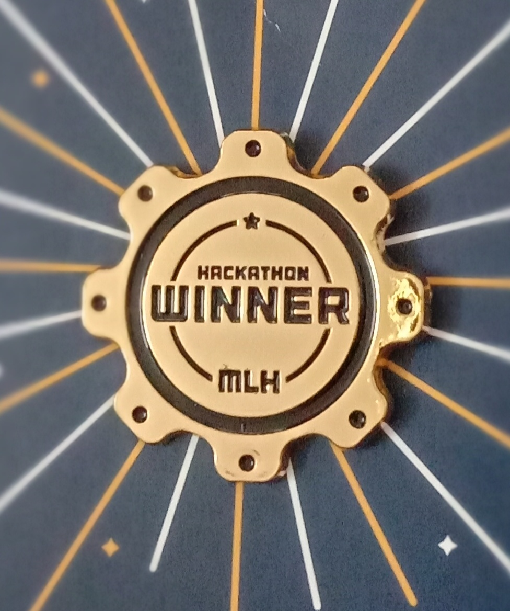

<h2 align="center">Hey There!👋</h2>
<h1 align="center">I'm Athul</h1>

 

 ⚙️ I enjoy working on IoT and Blockchain projects.  
 🏆 I actively participate in hackathons and have won prizes in a couple of them.   
 💡 I would love to collaborate on cool project ideas.   
 💬 I can help with: Solidity, Ethereum Smart Contracts, Arduino, ESP8266
 
 P.S. All my projects are currently open-source. ⚡
 
   

## I'm familiar with

 
 
 
 
 
 
 
 
 
 
  
 
 ### Hackathon flex (Only Devpost ones)
 
 

<samp>
Check out my popular repos ⬇️  
  </samp>

